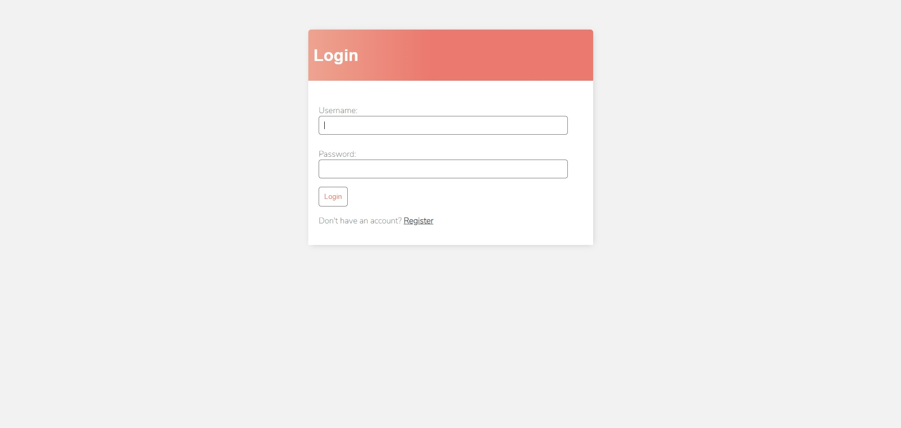
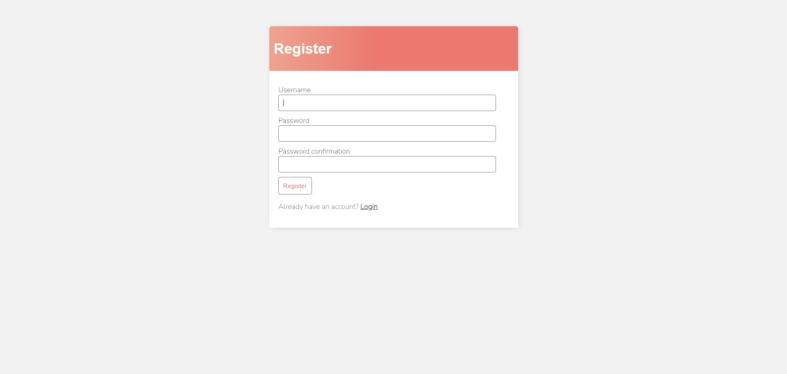
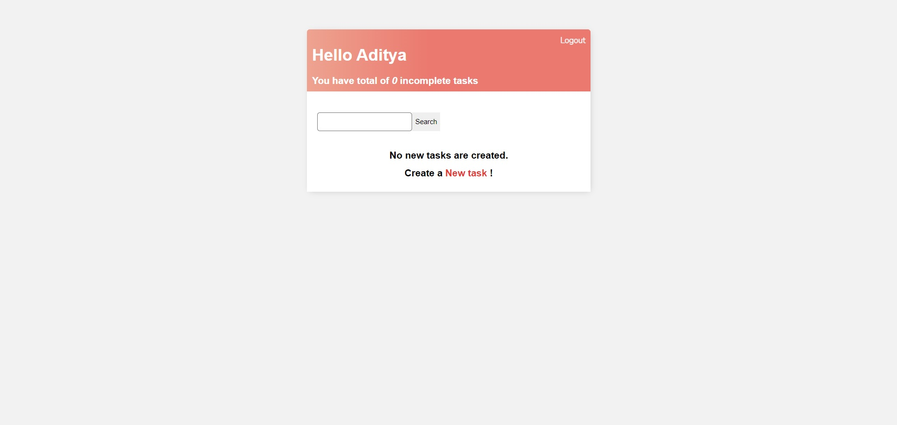
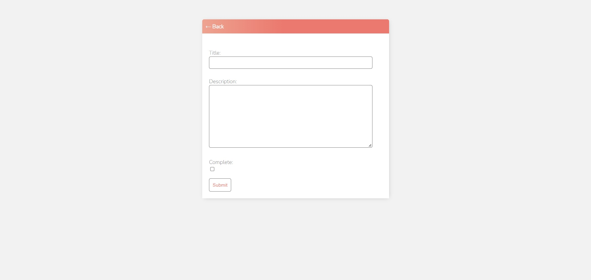
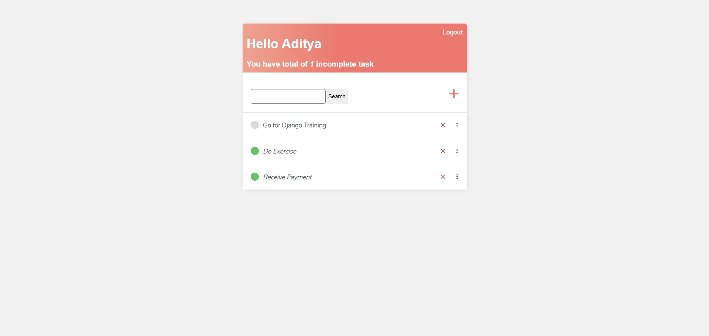

# Aditya Raj

## Table of Contents
* [General Info](#general-information)
* [Technologies Used](#technologies-used)
* [Features](#features)
* [Screenshots](#screenshots)
* [Setup](#setup)
* [Project Status](#project-status)
* [Contact](#contact)

## General Information
A Todo Web Application built on Python-Django framework. This webapp record todos and also can be deleted, modified or checked as completed according to user's need.

## Technologies Used
- HTML-5
- CSS-3
- Python
- Django Framework
-SQLite

## Features
- Simple UI
- User-friendly 
- CRUD Operations
- Secure
- Authentication Feature

## Screenshots






### Cloning the repository

--> Clone the repository using the command below :
```bash
git clone https://github.com/adityaraj-mishra/Todo-WebApp.git

```

--> Move into the directory where we have the project files : 
```bash
cd Todo-WebApp

```

--> Create a virtual environment :
```bash
# Let's install virtualenv first
pip install virtualenv

# Then we create our virtual environment
virtualenv envname

```

--> Activate the virtual environment :
```bash
envname\scripts\activate

```

--> Install the requirements :
```bash
pip install -r requirements.txt

```

#

### Running the App

--> To run the App, we use :
```bash
python manage.py runserver

```

> ⚠ Then, the development server will be started at http://127.0.0.1:8000/

#


## Project Status
 _completed_

## Deployment
_not-deployed-yet_

## Contact
- Project By: **Aditya Raj**.
- <a href="mailto: araj.mishra2000@gmail.com">Email Me</a>